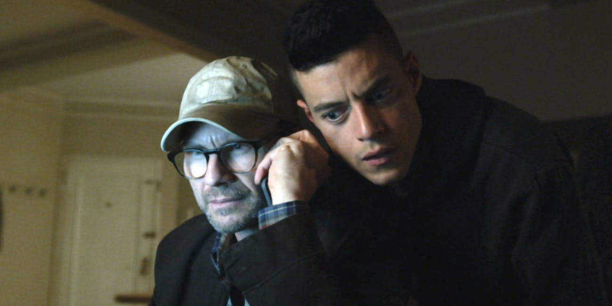

# Investigação

### Descrição
```
Navegando pela dark web, achamos um site bem suspeito... será que você consegue descobrir do que se trata?
```
**Pontuação**: 100
**Dica**: 
**Dica (anunciada)**: Você já parou pra pensar como a IA avançou? os robôs do Google sabem de tudo hoje em dia, até alguns segredos bem guardados!

### Write-up
O desafio contém um [link](http://18.223.33.77) que leva a uma página web que contém um outro link para executar download de um arquivo chamado "instructions.piz"


Usando o comando `file` do linux para identificar o tipo de arquivo, vemos que o resultado é um arquivo zip

```sh
$ file instructions.piz
instructions.piz: Zip archive data, at least v2.0 to extract
```

Ao tentar extrair, nos deparamos com um arquivo zip protegido com senha
```sh
$ unzip instructions.piz
Archive:  instructions.piz
[instructions.piz] d0nt_tru5t_wh4t_u_s3e.jpg password:
password incorrect--reenter:
password incorrect--reenter:
   skipping: d0nt_tru5t_wh4t_u_s3e.jpg  incorrect password
```

Podemos ver que dentro do zip tem um arquivo de imagem. Após algum tempo tentando quebrar a senha, não foi possível. Durante o CTF, um anúncio foi feito com a dica `Você já parou pra pensar como a IA avançou? os robôs sabem de tudo hoje em dia, até alguns segredos bem guardados!`.

Essa dica indica para olharmos de volta no servidor web por um arquivo bem comum utilizado pelos mecanismos de busca, o `robots.txt`.

Acessando o arquivo `robots.txt` do servidor, nos deparamos com o seguinte conteúdo:

```
User-agent: *
Disallow: /secret
```

Se acessarmos o [link escondido](http://18.223.33.77/secret/) pelo arquivo, nos deparamos com a seguinte página


Que por acaso tem um comentário escondido em seu código-fonte apontando para uma imagem chamada `key.jpg`


Acessando a URL escondida, obtemos a seguinte imagem, que aparenta ser a senha do zip que baixamos


Usando o conteúdo da imagem como senha do zip, conseguimos extrair o arquivo

```sh
$ unzip instructions.piz
Archive:  instructions.piz
[instructions.piz] d0nt_tru5t_wh4t_u_s3e.jpg password:
  inflating: d0nt_tru5t_wh4t_u_s3e.jpg
```

Que revela a seguinte imagem



Como é apenas uma imagem e o desafio fala o tempo todo sobre camadas, a primeira coisa a se fazer é rodar o `steghide` na imagem para ver se existe algo escondido. O `steghide` revela o seguinte conteúdo, sem senha nenhuma

```sh
$ steghide info /media/shared/d0nt_tru5t_wh4t_u_s3e.jpg 
"d0nt_tru5t_wh4t_u_s3e.jpg":
  format: jpeg
  capacity: 2.7 KB
Try to get information about embedded data ? (y/n) y
Enter passphrase: 
  embedded file "qr-code.png":
    size: 2.2 KB
    encrypted: rijndael-128, cbc
    compressed: yes
```

A imagem escondida é um QR code, que quando traduzido revela um [link para o PasteBin](https://pastebin.com/3Qj54jYd), que contém a flag do desafio!
